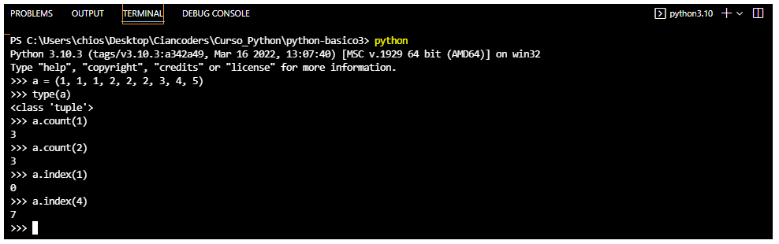

# Listas en python
## - Uso de listas

## - Uso del módulo copy

## - Uso de for para recorrer lista

## ------------------------------------------------------------------------------------------------------------
# Operaciones con listas

## - Uso de append

## - Uso de pop y del 

## - uso de random y sort

## ------------------------------------------------------------------------------------------------------------

# Tuplas and Set

## - Uso de tuplas

## - Uso de set

## ------------------------------------------------------------------------------------------------------------

# Comprehensions

## ------------------------------------------------------------------------------------------------------------

# Busqueda binaria
